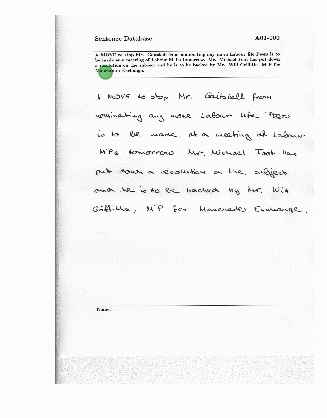

# ML Project



### Step 1. Download data

The first step is to obtain the IAM dataset from the FKI's webpage. You'll need
to [register](http://www.fki.inf.unibe.ch/DBs/iamDB/iLogin/index.php) in their website, in order to download it. Then you can download the forms from [here](http://www.fki.inf.unibe.ch/DBs/iamDB/data/).

```
mkdir data
cd data
# xml files
wget http://www.fki.inf.unibe.ch/DBs/iamDB/data/xml/xml.tgz --user=<USER_NAME> --password=<PASSWORD>
# forms A-D
wget http://www.fki.inf.unibe.ch/DBs/iamDB/data/forms/formsA-D.tgz --user=<USER_NAME> --password=<PASSWORD>
# forms E-H
wget http://www.fki.inf.unibe.ch/DBs/iamDB/data/forms/formsE-H.tgz --user=<USER_NAME> --password=<PASSWORD>
# form I-Z
wget http://www.fki.inf.unibe.ch/DBs/iamDB/data/forms/formsI-Z.tgz --user=<USER_NAME> --password=<PASSWORD>
mkdir xml
mkdir forms

tar -xf formsA-D.tgz -C forms/
tar -xf formsE-H.tgz -C forms/
tar -xf formsI-Z.tgz -C forms/
tar -xf xml.tgz -C xml/
```

### Step 2. [Data Exploration](https://github.com/jordanott/ML-Project/tree/master/DataExploration)

### Step 3. [Pick an Agent](https://github.com/jordanott/ML-Project/tree/master/src/agents)

### Step 4. [Train]()
