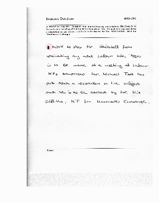
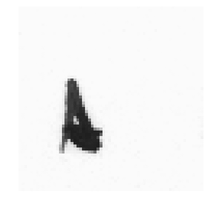

# ReaderNet

The degree of opacity represents the magnitude of the reward (darker = larger magnitude).  
The color represents the sign of the reward (green = positive; red = negative; black = 0).


Environment View         |  State view  
:-------------------------:|:-------------------------:  
  |    

## To Do
- [ ] Change to letter predictions
  * CTC loss
- [ ] Save models (checkpoints)
  * Networks
  * Monitors
  * Environments
- [ ] Letter prediction plots
  * Probability of each letter selected

### Step 1. Download data

The first step is to obtain the IAM dataset from the FKI's webpage. You'll need
to [register](http://www.fki.inf.unibe.ch/DBs/iamDB/iLogin/index.php) in their website, in order to download it. Then you can download the forms from [here](http://www.fki.inf.unibe.ch/DBs/iamDB/data/).

```
mkdir data
cd data
# xml files
wget http://www.fki.inf.unibe.ch/DBs/iamDB/data/xml/xml.tgz --user=<USER_NAME> --password=<PASSWORD>
# forms A-D
wget http://www.fki.inf.unibe.ch/DBs/iamDB/data/forms/formsA-D.tgz --user=<USER_NAME> --password=<PASSWORD>
# forms E-H
wget http://www.fki.inf.unibe.ch/DBs/iamDB/data/forms/formsE-H.tgz --user=<USER_NAME> --password=<PASSWORD>
# form I-Z
wget http://www.fki.inf.unibe.ch/DBs/iamDB/data/forms/formsI-Z.tgz --user=<USER_NAME> --password=<PASSWORD>
mkdir xml
mkdir forms

tar -xf formsA-D.tgz -C forms/
tar -xf formsE-H.tgz -C forms/
tar -xf formsI-Z.tgz -C forms/
tar -xf xml.tgz -C xml/
```

### Step 2. [Data Exploration](https://github.com/jordanott/ML-Project/tree/master/DataExploration)

### Step 3. [Pick an Agent](https://github.com/jordanott/ML-Project/tree/master/src/agents)

### Step 4. Network Paradigms

1. **One network:** the reader network, *π<sub>r</sub>*, takes in a small chunk of the environment (the state, *S*, POMDP) and produces an action, *a*, and a word prediction, *w*. The environment then returns a new state depended on *a*.  
  * *π<sub>r</sub>( a | S )*  
    * Letter prediction
      * Actions(discrete): Up, down, left, right, newline
    * Word prediction
      * Actions(discrete): Up, down, left, right, newline, classify  
2. **Two networks:** the master network, *π<sub>m</sub>*, takes in the whole page (the environment, *E*, fully observable MDP) and predicts an *x,y* location of where to look with high resolution. This glimpse is a small chunk of the environment (the state, *S*, POMDP). *S* is feed to the worker network π<sub>w</sub>, which produces an action recommendation, *a* for the master network and a word prediction, *w*.  
  * *π<sub>m</sub>( x, y | E, A<sub>w</sub>=a )*  
    * Actions: x, y (continuous)  
  * *π<sub>w</sub>( a, w | S )*  
    * Actions: Up, down, left, right, newline (discrete)

### Step 5. [Training Paradigms]()
These represent possible paradigms for training. Options in **bold** are the current paradigm being implemented.

1. Training word recognition  
  * Imitation learning  
    * Word Prediction: Show sequences from teacher with correct word label as output
    * **Letter Prediction:** Show sequences from teacher with correct letter sequence as output (CTC will be used here)
  * Bootstrapping
    * Word Prediction: Gather sequence where agent hovers over word. Label the sequence as the correct word.
    * Letter Prediction: Gather sequence where agent hovers over word. Label the sequence as the correct letter sequence as output (CTC will be used here)
2. Training eye controller
  * **Imitation learning** (for *n* epochs then switch to RL)
    * Match actions taken by teacher (cross-entropy loss)  
  * Bootstrapping (word hover rewards can be used)
    * Q-learning
    * Policy Gradient
